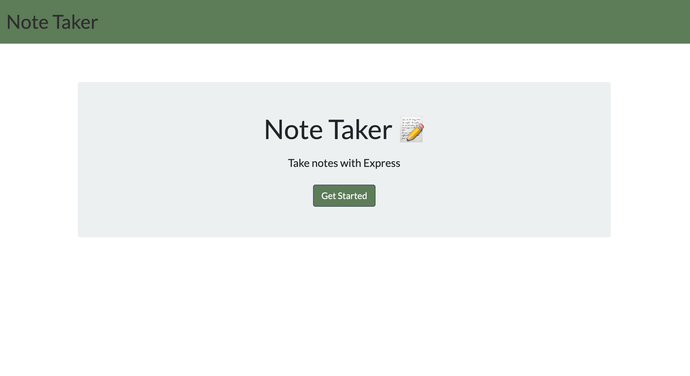
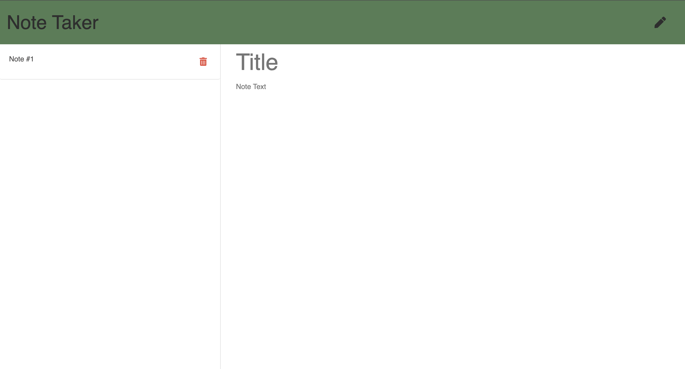

 https://opensource.org/licenses/ISC
  
  # Note Taker
  
  ## Description
  This is an application developed using express.js that allows the user to write, save and delete notes. The application is deployed in Heroku.

  ## Application link
  https://aqueous-dusk-70794.herokuapp.com/
  
  ## Table of contents
  - [Installation](#installation)
  - [Usage](#usage)
  - [Contribution](#contribution)
  - [Test](#test)
  - [License](#license)
  - [Images](#images)
  - [Questions](#questions)

  ## Installation
  In order to run the application from your own local machine, express will need to be downloaded. Simply use the command "npm i" in the terminal to install.

  ## Usage
  Free to use

  ## Contribution
  If you see a potential improvement, please feel free to contribute

  ## Test
  n/a

  ## License
  ISC

  ## Images
  
  

  ## Questions
  Github: https://github.com/SamuelHeal
  Email: samuelheal@hotmail.com
  
